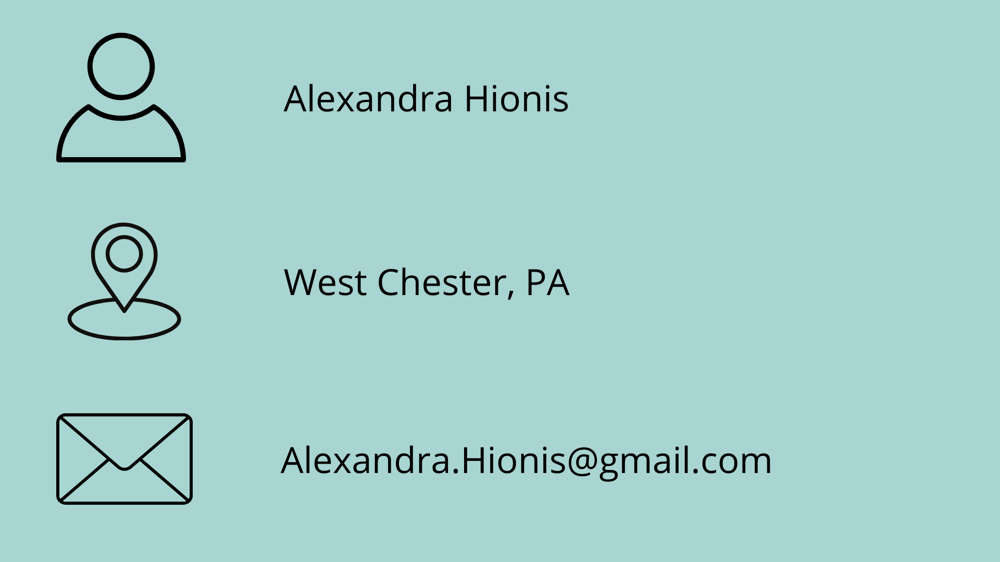
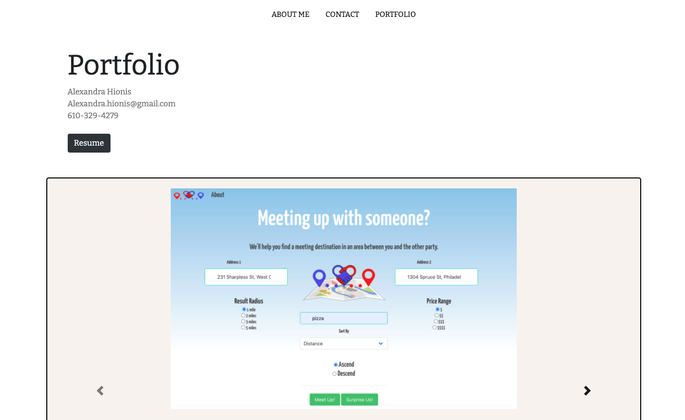

Portfolio & About Me Page

This project consists of an 'about me' page, a 'contact' page, and a 'profile page' highlighting some key attributes about myself. This was completed for Penn LPS Coding Bootcamp.
This should display resposive bootstrap 4.5 webpages all utilizing rows, columns, grid system, and any other responsive elements.
This profile will display different uses of that criteria through three simple webpages. I put a lot of time into it, I hope whoever views it enjoys it!

