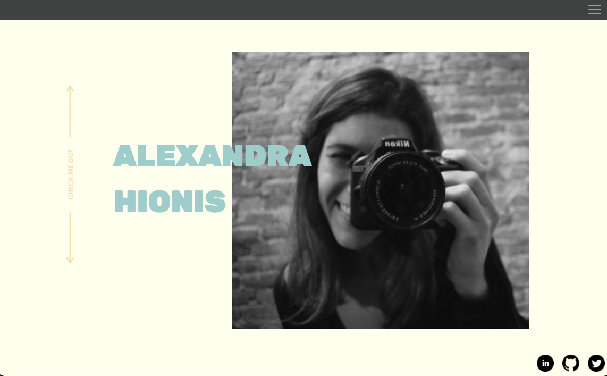
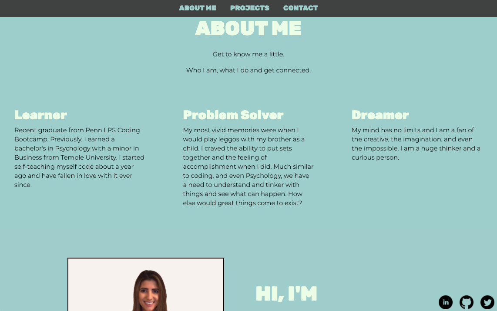
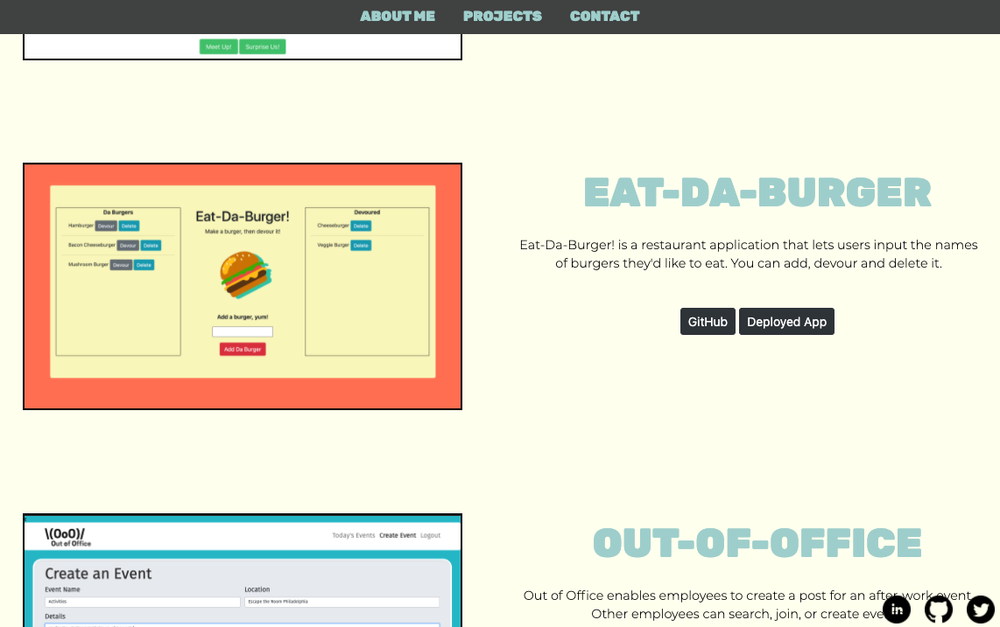
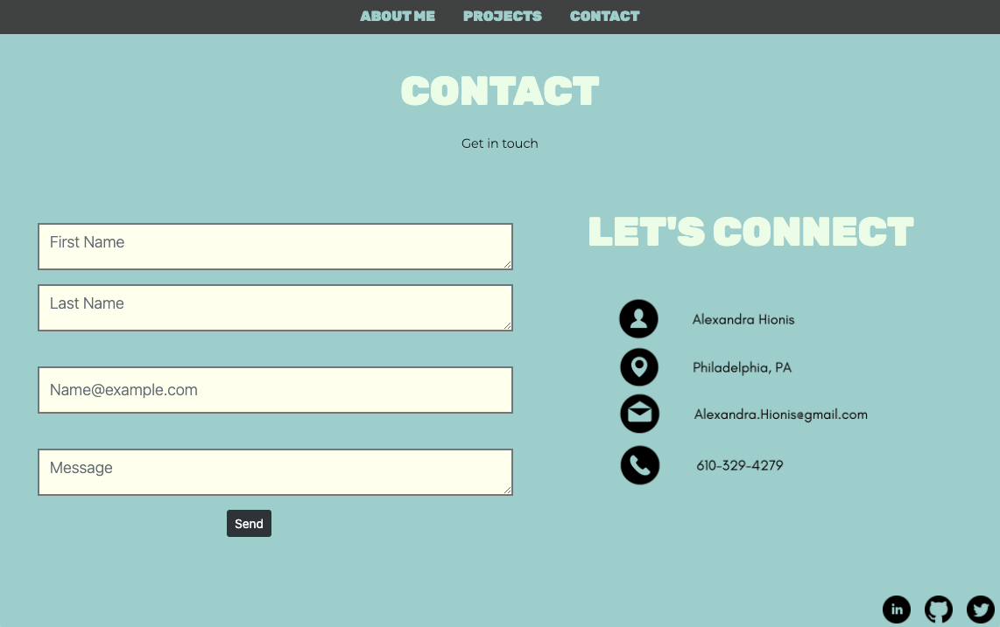

https://alexandra-hionis.github.io/

## Portfolio & About Me Page
## Description
 This project consists of an 'about me' page, a 'contact' page, and a 'project page' highlighting some key attributes about myself. It uses html, css and javascript. This should display resposive bootstrap 4.5 webpages all utilizing rows, columns, grid system, and any other responsive elements. I added in a mix of css and javascript animations to make it more interactive. I put a lot of time into it, I hope whoever views it enjoys it!

## Table of Contents
- [Description](#description)
- [Usage](#usage)
- [License](#license)
- [Contributing](#contributing)
- [Questions](#questions)

## Usage

 
## Contributing
[Alexandra Hionis](https://github.com/Alexandra-Hionis/README-Generator)

Referenced work by [Kevin Powell](https://www.youtube.com/watch?v=huVJW23JHKQ) on youtube. He explained it well and I learned new concepts, such as IntersectionObserver.

## Questions
GitHub: https://github.com/Alexandra-Hionis  
Email: Alexandra.hionis@gmail.com  
